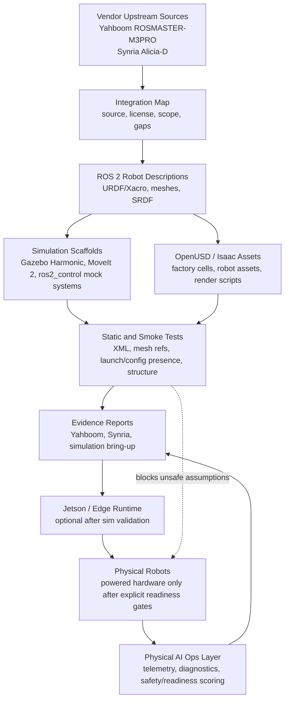

# Architecture

This repository is a simulation-first Physical AI systems engineering platform. Vendor
packages, CAD, and drivers are inputs to the platform; they are not the product boundary.
The platform boundary is the validation loop that turns robot descriptions, OpenUSD
assets, ROS 2 simulation scaffolds, evidence reports, and later hardware runs into a
repeatable engineering workflow.

## Simulation-First System

## Planes

- **Source intake plane:** vendor docs, SDKs, ROS packages, CAD, meshes, licenses, and
  hardware-specific assumptions are cataloged before they are adapted.
- **Description plane:** repo-owned URDF/Xacro, mesh references, transforms, inertials,
  SRDF, and controller interfaces provide the common robot-model contract.
- **Simulation plane:** Gazebo, MoveIt 2, ros2_control mock hardware, OpenUSD scenes, and
  Isaac render/training assets validate behavior without requiring powered robots.
- **Evidence plane:** repeatable report templates capture commands, logs, screenshots,
  known gaps, and pass/fail status for portfolio-quality engineering records.
- **Runtime plane:** Jetson and physical robot code is introduced only after simulation
  checks pass and the evidence trail says what is safe to test on hardware.
- **Operations plane:** telemetry, diagnostics, RAG over docs/logs, and safety/readiness
  scoring turn runs into actionable system knowledge.

## Repository Boundaries

The repo should keep platform-owned artifacts in stable locations:

- `ros2_ws/src/*_description`: robot descriptions, meshes, RViz configs, and display
  launches.
- `ros2_ws/src/*_gazebo`: simulation worlds, mock control, and Gazebo launch scaffolds.
- `ros2_ws/src/*_moveit_config`: planning groups, kinematics, limits, and MoveIt demos.
- `isaac/usd`: OpenUSD scenes and robot asset staging.
- `isaac/scripts`: rendering and asset utility scripts.
- `scripts/linux_rtx`: optional developer smoke tests for Linux RTX workstations.
- `reports`: evidence templates and completed bring-up records.
- `docs`: architecture, integration maps, roadmap, and operating assumptions.

Vendor drops should be staged intentionally and documented in
`docs/VENDOR_INTEGRATION_MAP.md`. Do not mirror vendor repositories wholesale unless a
specific artifact is needed for simulation or later hardware validation.

## Validation Gates

Before physical hardware is powered or commanded, the following simulation-first gates
should pass or have an explicit waiver in the relevant report:

1. URDF/Xacro files are well-formed and include references resolve within the workspace.
2. Mesh references point to repo-owned files or documented external assets.
3. Launch, controller, MoveIt, Gazebo, and OpenUSD files expected by the platform exist.
4. Robot descriptions expose expected links, joints, sensors, and mock control interfaces.
5. Simulation smoke tests run in bounded time and do not require serial devices, motors,
   cameras, batteries, or robot power.
6. Evidence templates record environment, command output, logs, screenshots, and known
   deviations.

## Hardware Policy

Hardware-only code belongs behind explicit bring-up steps, environment checks, and
operator-controlled commands. The default path in this repository is simulation, mock
control, static validation, and evidence collection.
