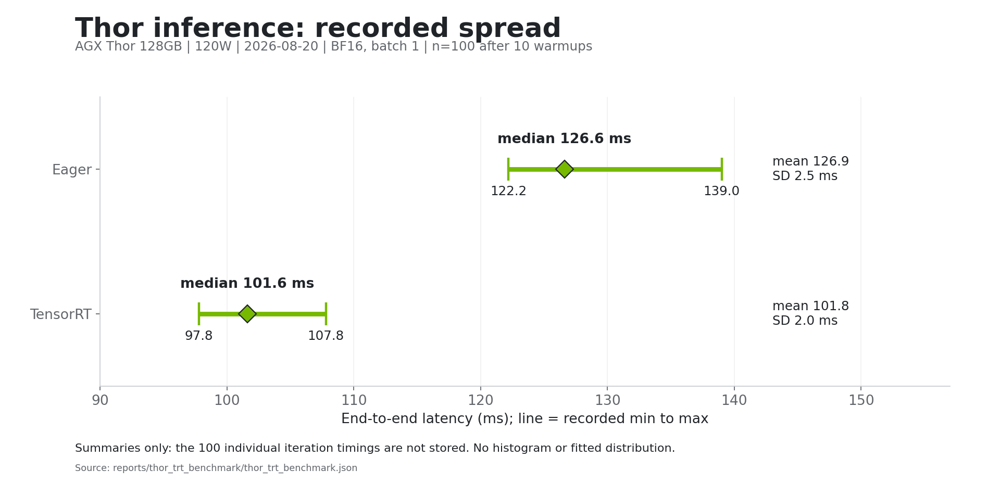
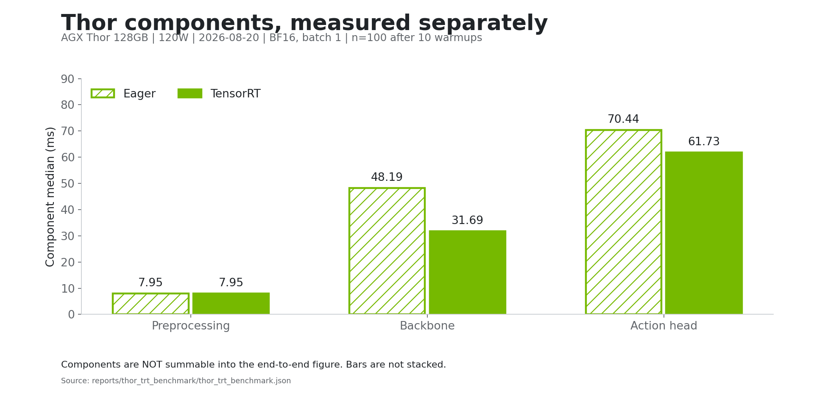
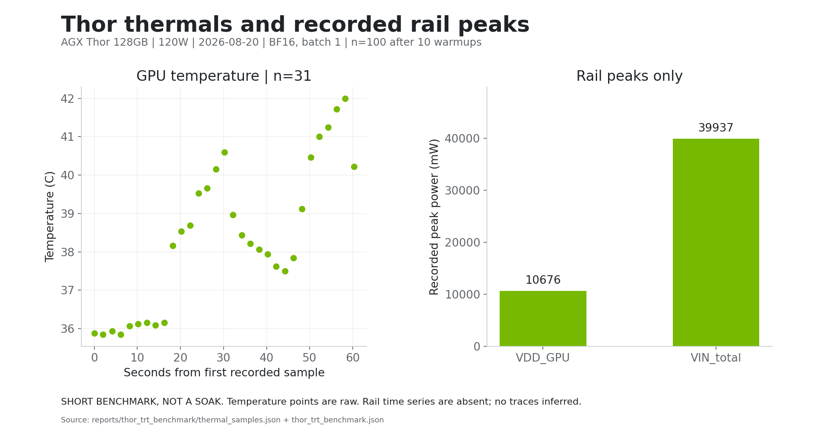
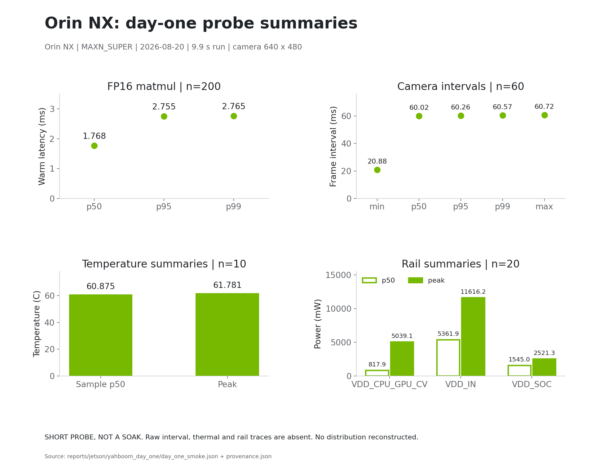
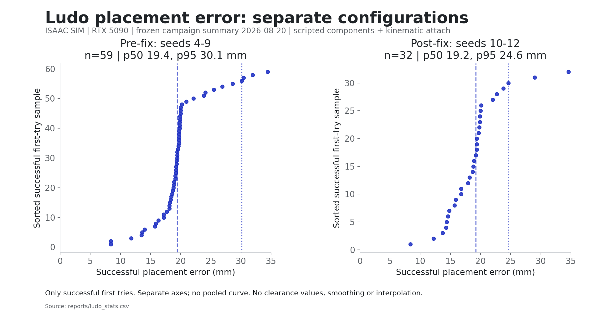
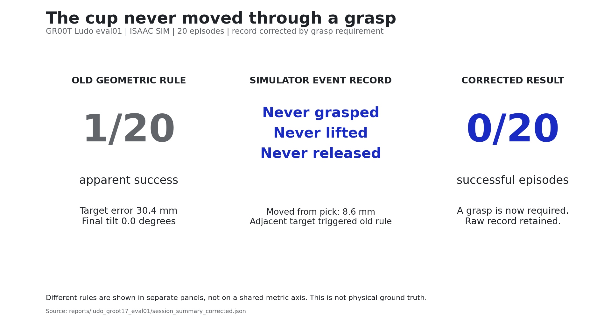
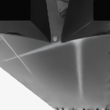
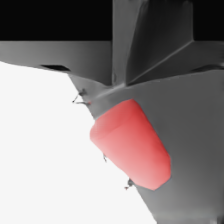
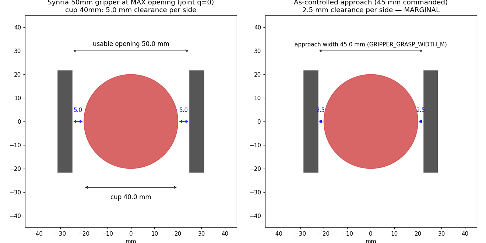

# Evidence

Recorded device measurements, simulation outcomes and corrections. Device plots
use NVIDIA green; simulation plots use blue. Charts are regenerated from report
files by [plot_evidence.py](../../scripts/plot_evidence.py), with
[source hashes and data gaps](figures/sources.json).

## What Was Measured

| Workload | Hardware and date | Scope / record |
| --- | --- | --- |
| GR00T eager and TensorRT inference | AGX Thor 128GB, 120W, 2026-08-20 | BF16, batch 1, 100 iterations after 10 warmups; simulated dataset inputs. [Benchmark](../../reports/thor_trt_benchmark/thor_trt_benchmark.json) |
| CUDA matmul, camera grab, thermal/power probe | Orin NX, MAXN_SUPER, 2026-08-20 | 9.9-second run. [Probe](../../reports/jetson/yahboom_day_one/day_one_smoke.json), [provenance](../../reports/jetson/yahboom_day_one/provenance.json) |
| Ludo executor placements | RTX 5090 / Isaac Sim; post-fix runs 2026-08-19, frozen aggregate 2026-08-20 | Scripted components, PPO policy, kinematic attach and release-hold. [Run](../../reports/ludo_soak_s10/provenance.json), [separate post-fix aggregate](../../reports/ludo_stats_frozen/stats_2026-08-20T050701Z_reports_ludo_soak_s1%5B012%5D.json) |

## Device Results

### Thor Inference



Eager measured **126.6 ms median / 7.9 Hz**; TensorRT measured
**101.6 ms median / 9.8 Hz**. The figure shows recorded minimum, maximum,
median, mean and standard deviation. The JSON and log describe 100 iterations
but retain no individual timing array, so a raw distribution cannot be drawn.
[JSON](../../reports/thor_trt_benchmark/thor_trt_benchmark.json),
[log](../../reports/thor_trt_benchmark/bench.log), [SVG](figures/thor_latency.svg).



Component medians are shown separately for eager and TRT. **They are not
summable into the end-to-end figure.** No stacked total is constructed.
[Source](../../reports/thor_trt_benchmark/thor_trt_benchmark.json),
[SVG](figures/thor_components.svg).

### Thor Thermal and Power Scope



The 31 GPU temperature samples reach **42.0 C**; the benchmark record reports
no throttling observed over this run. The benchmark JSON's own throttling note
quotes a junction peak near 40.5 C, while the raw samples reach tj 42.1 C; the
chart plots the raw GPU samples and the source is left unaltered (see
[data gaps](DATA_GAPS.md)). The temperature file contains no rail
time series; only the separately recorded rail peaks can be shown.
**This is a short benchmark, not a soak test.**
[Samples](../../reports/thor_trt_benchmark/thermal_samples.json),
[peak/throttling record](../../reports/thor_trt_benchmark/thor_trt_benchmark.json),
[SVG](figures/thor_thermal_power.svg).

### Orin NX Day-One Probe



The figure shows recorded matmul percentiles, camera interval summaries,
temperature p50/peak and rail p50/peak. Labels round for readability; exact
values remain in the source. Raw timing, temperature and power sequences are
not retained in the JSON, so no distribution or temporal trace is inferred.
**The 9.9-second probe is not sustained validation.**
[Probe](../../reports/jetson/yahboom_day_one/day_one_smoke.json),
[device/date](../../reports/jetson/yahboom_day_one/provenance.json),
[SVG](figures/orin_day_one.svg).

## Simulation Results



Each point is one successful first-try placement error from
[reports/ludo_stats.csv](../../reports/ludo_stats.csv). The pre-fix and post-fix
configurations have separate axes. The figure never reads the
sentinel-bearing `closest_approach_mm` column. It excludes failed attempts and
does not mix in the separately scored GR00T lane.
Percentiles here and in the frozen records are index-based nearest-rank values:
the sorted sample at index `round(p * (n - 1))`. Linear interpolation on the
same 32 post-fix values would give p95 26.6 mm rather than 24.6 mm.
[Aggregation code](../../scripts/plot_evidence.py), [SVG](figures/ludo_placement.svg).

The historical pooled summary records **p50 19.3 mm / p95 30.1 mm** over
successful first tries across both configurations. That is a description of the
retained pooled artifact, not a new homogeneous-campaign claim; the chart shows
the blocks separately. The post-fix block records **32/36 first tries** and **35/36 turns** after the
executor's built-in single retry (3 of 36 turns succeeded on retry; 4 retries
ran across 40 attempts), with successful-error p50 **19.2 mm** and p95
**24.6 mm**.
[Pooled record](../../reports/ludo_stats_frozen/stats_2026-08-20T050701Z_reports_ludo_soak_sSTAR.json),
[post-fix record](../../reports/ludo_stats_frozen/stats_2026-08-20T050701Z_reports_ludo_soak_s1%5B012%5D.json).

**These are Isaac Sim outcomes, not physical manipulation.** The executor uses
scripted components and simulator attach/release interventions.
[Executor](../../isaac/scripts/ludo_turn_executor.py),
[limits](../../reports/NOT_CLAIMED.md).

## What the Corrections Revealed



The old geometric rule accepted a cup already near an adjacent target. The
recorded apparent success had **30.4 mm target error**, but `grasped`,
`lifted` and `released` were all false. The corrected result is **0/20**.
The figure uses simulator event records, not physical object-success ground
truth. The old and corrected rules are deliberately not compared on a shared
metric axis.
[Corrected sidecar](../../reports/ludo_groot17_eval01/session_summary_corrected.json),
[raw summary](../../reports/ludo_groot17_eval01/session_summary.json),
[SVG](figures/gr00t_correction.svg).

The target was not observable in that GR00T run's constant instruction or
rendered observation. It is not a fair goal-conditioned placement comparison.
[Investigation and correction](../notes/groot17_eval01_findings_2026-08-20.md).

The earlier **128 ms / 7.8 Hz TensorRT attribution is also retracted**. It was
a torch.compile baseline; the TRT stage failed on missing `matplotlib`.
The recovered benchmark is the Thor result above. Numeric parity remains
unrecorded.
[Correction record](../notes/instrumentation_pass_2026-08-19.md),
[benchmark](../../reports/thor_trt_benchmark/thor_trt_benchmark.json).

## What Is Not Established

Autonomous real-arm pick/place, physical object-success ground truth,
TensorRT/PyTorch numerical parity, and sustained thermal/safety validation.
These exclusions are stated in [NOT_CLAIMED](../../reports/NOT_CLAIMED.md).

## Media: What the Camera and Geometry Show

### G3 Perception Overlay

[Watch the existing G3 demo](../../reports/g3_session_01/g3_demo.mp4).

This first-party composition shows a simulated wrist view with ER-2 cup-fix
round-trip/age overlays and ACT control phase. It illustrates observation timing
and camera framing, not physical-arm success. Vendor robot geometry is depicted.
The view can be visually ambiguous without the associated records.
[Video](../../reports/g3_session_01/g3_demo.mp4),
[sidecar](../../reports/g3_session_01/sidecar.jsonl),
[frame metadata](../../reports/g3_session_01/frames_meta.jsonl).

### Gate Inputs



Negative-verdict example: this simulated view is dominated by the gripper/table;
it does not supply a clear view of the cup. This is evidence about what the gate
was shown, not proof that a physical object was absent.
[Source image](../../reports/gate_audit/grasp_s145_e0_vFalse.png),
[gate audit record](../SYNRIA_EXPERIMENT_LEDGER.md).



Positive-verdict example: the red cup is visible near the simulated gripper.
The input image alone does not establish a stable grasp or completed placement.
[Source image](../../reports/gate_audit/grasp_s148_e13_vTrue.png).
Both images are first-party captures depicting vendor geometry.

### Gripper Clearance



This first-party schematic compares the modeled cup clearance at maximum and
commanded jaw opening. It is geometry context, not a contact or task-success
measurement. Read it with the audit's retained amendments.
[Source image](../../reports/synria_gripper_clearance.png),
[amended grasp audit](../../reports/synria_grasp_audit.md).

### Remaining Media and Scenes

The [media assessment](MEDIA_INVENTORY.md) and
[file-by-file catalog](media_inventory.csv) cover existing tracked training and
evaluation media, gate images, scene layers and Mermaid views. Unreviewed
episodes are labelled as such. Vendor scenes and geometry are context, not
performance evidence; their dependencies are now obtained separately.
[Asset provenance](../VENDOR_ASSET_REMOVAL.md).

Raw corpora, checkpoints, per-run frame dumps, per-frame metadata and per-run
videos are not distributed and are not under LFS; the tracked records per run
are provenance, session summary and turns. See
[Data availability](../../README.md#hardware-and-environment).

## Reproduce the Presentation

```bash
python -m pip install matplotlib==3.10.9
python scripts/plot_evidence.py
python scripts/inventory_evidence_media.py
```

Run from the repository root. These scripts read existing files only: no device
probes, benchmarks, training or new measurements. PNG/SVG outputs and source
hashes are under `docs/evidence/figures/`.
[Chart script](../../scripts/plot_evidence.py),
[inventory script](../../scripts/inventory_evidence_media.py),
[missing-data record](DATA_GAPS.md).
