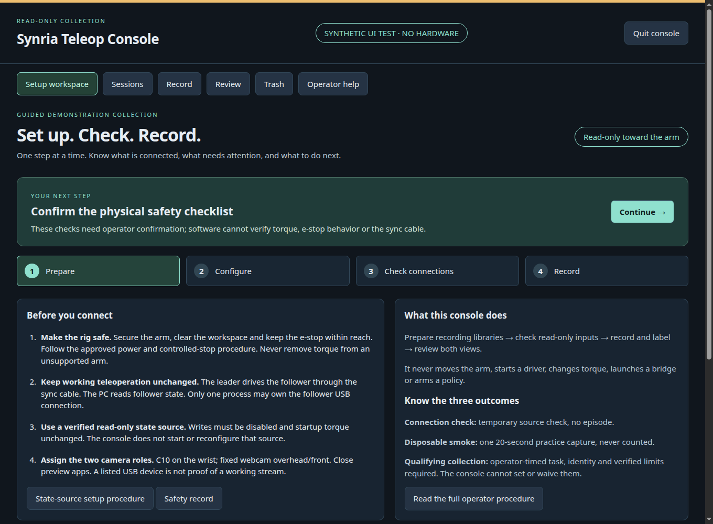
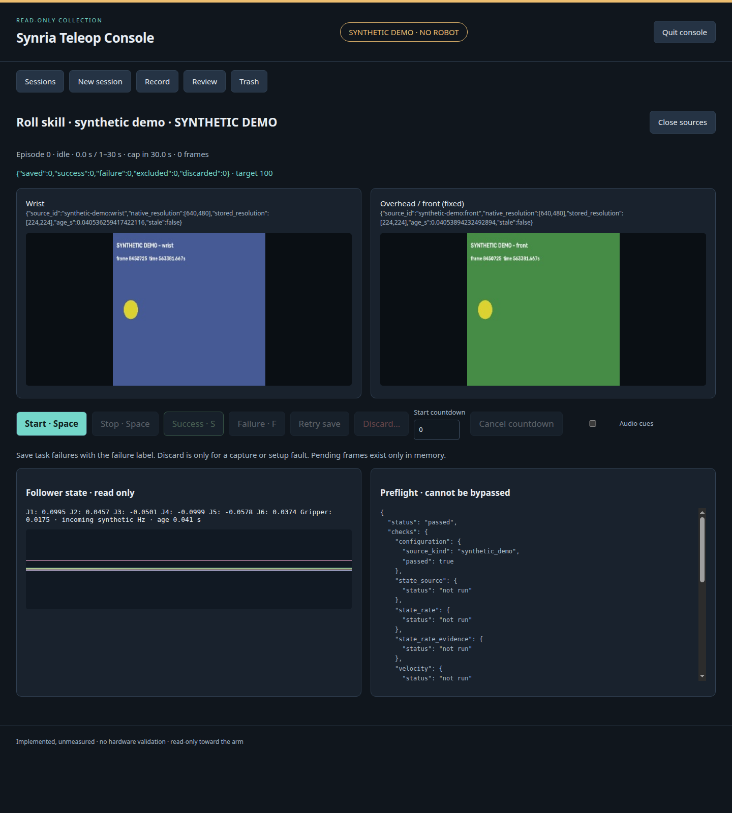

# Synria Teleop Console

**Implemented, unmeasured.** A local recording and review surface for the
Synria/Alicia-D leader-follower operator. It observes the existing recorder;
it does not move the arm or start teleoperation. D1–D5 remain planned.

## Launch

Use the existing Python 3.12 recording environment with the `robot-learning`
extra and ffmpeg. Demo also needs that extra: it writes real upstream datasets,
not a substitute format. Use an editable repository install so the canonical
task registry and limits remain beside the installed sources. From the repository root:

```bash
source "$RECORDING_VENV/bin/activate"
python -m pip install -e '.[robot-learning,vision]'
synria-teleop-console --demo --workspace "$HOME/synria-console-demo"
```

The browser opens automatically. For a future authorized physical session,
complete [the D1 safety and wiring preflight](D1_OPERATOR_RUNBOOK.md#1-safety-wiring-and-recording-environment),
retain its read-only state-source configuration, then launch:

```bash
scripts/linux_rtx/synria_teleop_console.sh --workspace "$HOME/synria-console"
```

The [RTX launcher](../../scripts/linux_rtx/synria_teleop_console.sh) activates
`RECORDING_VENV` (default `/srv/venvs/synria-d1-py312`, then
`$HOME/venvs/synria-d1-py312` if the former is absent). Physical mode sources
`RECORDING_ROS_SETUP` (default `/opt/ros/jazzy/setup.bash`) to expose library paths;
demo mode skips that setup. It never starts a ROS node or any robot process.
A missing setup file produces a Not ready warning but still opens the interface
so its dependency errors are visible. Copy the [desktop entry](../../scripts/linux_rtx/synria-teleop-console.desktop)
to `~/.local/share/applications/`, adjusting its checkout, workspace and
environment paths for this host; preserve the authorized ROS domain and middleware
settings. Neither launch configures a driver. Direct entry-point launches still
require an already prepared recording/ROS environment.

## Use

The setup workspace guides **Prepare → Configure → Check connections → Record**.
The next-step banner names the current blocker and opens its procedure in place.
Operator help includes the local runbook, protocol, decisions and safety records;
it works without external network access. The state-source procedure distinguishes
an unverified standalone candidate from the still-unrecorded site-specific
read-only ros2_control startup procedure. Neither is executed by the page.



Four connection cards separate follower, action source, wrist and fixed-front
status from software availability and qualifying evidence. A created subscription
is not proof of incoming data. Stale or changed settings invalidate connection
results. Errors offer short recovery steps for state timeout/domain mismatch,
camera ownership, rate, freshness, competing publishers, disk space, contract
mismatch, blocked recovery and failed saves. Technical details remain expandable.
Background polling never dismisses an error or repeats a failed mutation.
Retry save preserves pending frames; successful explicit retry clears its error.
Keyboard capture controls are disabled inside dialogs, focused controls and
browser shortcut combinations. No procedure can bypass a recorder guard.



Home lists named sessions and saved success/failure, excluded and target counts.
Create selects the registry task, explicit gripper/source kind, cameras, rate,
image size and operator metadata. Real task windows remain unset: qualifying
collection is refused until prospective operator timing is recorded in
[DECISIONS.md](DECISIONS.md) and the registry is configured outside the console.
Only disposable smoke is available before then. Its button runs the shared
preflight, then automatically starts the existing 20-second temporary capture;
this flow is fake-tested, not hardware-verified. Review remains available until
closing its context, when temporary data is disposed. It never qualifies.

The new-session form offers documented Synria presets: explicit 15/30 FPS
choices, 224-pixel stored dimensions, one-frame lookahead, a 10-second first-state
wait and 10/50/100-episode targets. Each has a custom-value option; existing
validation remains authoritative. Follower-state actions remain the default
for hardware-sync wiring; USB leader actions remain optional. Gripper and state
source have no assumed selection. Choose actual camera IDs, identity and power
state yourself. Presets are candidates or software defaults, not hardware
measurements, verified limits or qualifying counts. The native final still and
operator-owned task windows are unchanged. **Implemented, unmeasured.**

Setup fills the host/account and available storage from this machine, restores
recent operator-entered gripper/source/camera/scene fields for review, and
suggests the runbook's 15 FPS starting candidate plus the existing image,
lookahead and startup defaults. Use recommended recording values reapplies
these candidates; it does not change a saved session or the CLI's required FPS.
New edits made while setup loads are preserved. Safety confirmations are never
restored or automatically checked; current power and manufacturer serial are
not inferred from past sessions.

USB connection identity lists stable `/dev/serial/by-id/` names without opening
ports. A sole available entry is offered as an **unverified candidate**, not a
proven follower association. Unknown/unverified remains an explicit selection
when none is chosen; multiple connections are not assigned automatically.
The optional hint is stored separately in session settings and its mirror,
never copied into the manufacturer serial or used to open a port. Missing
required fields are named individually. Unknown manufacturer identity remains
a recording blocker; selecting a USB ID does not remove that requirement.
Missing manufacturer serial or starting-power text does not block the no-episode
connection diagnostic. Its separate **recording metadata** check lists these
missing facts, leaves them unknown and prevents green readiness. Creating a
session or recording a disposable smoke episode still requires both fields.
The operator must still confirm actual power and all physical safety checks
before any diagnostic source opens. Unattempted checks say **NOT CHECKED**, not
that the device failed.

**Pre-recording readiness** on New session offers a read-only check button and
a text-labeled red/amber/green meter. First select the two cameras in the
dedicated Camera mapping panel; Refresh camera IDs lists names without opening
devices. Two video interfaces advertising the same USB identity are refused as
a two-camera mapping. No camera roles are guessed.

The separate software panel shows **Launching** while checking availability,
then **Ready** or **Not ready**, with one row for each library/encoder and a short
missing-dependency message. It checks automatically on page load and before
connection preflight; Recheck software does not start sources or services.
Library discovery is not a compatibility or hardware test. Each connection path
(follower state, action source, wrist camera and front camera) also has its own
status and failure reason. **Launching** on a source path means opening/checking
read-only inputs, never launching a driver. Unattempted paths remain **Not checked**;
technical details are collapsed beneath the short message. No software status
overrides the recording metadata, timing, limits or physical safety checks.

Before physical checks, explicitly confirm the runbook safety preflight,
secured arm, emergency stop, unchanged-torque read-only source, leader sync
connection and camera identities. The button temporarily opens subscriptions
and cameras through the existing recorder builder using disposable purpose,
then closes them and removes its empty temporary dataset. It does not start an
episode, save a demonstration, start a driver or move either arm. It checks
dependency availability, state callback rate, source freshness/header stamps,
velocity requirements, command-topic publisher guards, frame size/brightness,
distinct samples, timestamp alignment, configured limits, disk space and task
configuration. Each result and operator confirmation is audited in the catalog.

The meter says **Not checked**, **Checking connections**, **Connection checks
incomplete**, **Connected · setup required**, or **Ready for session preflight**.
Unverified limits or unset task timing prevent green physical readiness even
when connections work. Results expire after 60 seconds; edited form settings
or withdrawn confirmations invalidate green display. Demo results are always
labeled synthetic. The button refuses to open a second pair of sources while
a session owns them. Green is a connection snapshot, not motion authorization:
the actual session contract, dataset lock/recovery and start guards still run
again. A standalone leader without USB, physical cable integrity, torque,
e-stop function and camera framing cannot be certified by software. Frozen
video and full episode quality still require their existing recording gates.
No live physical check was run during development. **Implemented, unmeasured.**

Record shows both latest camera views, source age/resolution, follower state,
preflight results, elapsed time and the hard cap. Space starts/stops; S/F label
a stopped episode. Optional countdown and audio cues support hands-busy use.
Retry keeps failed-save frames; Discard needs confirmation and a reason. Tab
closure does not stop capture; the server enforces the cap. Page Quit refuses
pending frames. Process signals close sources and audit any lost pending frames.

Review locks both cameras to the same stored row, with frame stepping, scrub,
speed, state/action traces, timestamps/skew, provenance and native final still.
Server-side decoding and a bounded JPEG cache avoid browser video-codec needs.
Playback only displays data. Close the capture run before curation or reindex.

## Storage and curation

The workspace must be outside git. It contains `console.sqlite3`, five rotating
consistent backups in `backups/`, and `sessions/<slug>/session.json` beside
`dataset/` and `dataset.exclusions.jsonl`. Synthetic sessions instead occupy
`sessions-demo/` and show a demo banner. Trash is `trash/<slug>-<utc>/`.
No console file is placed inside the recorder-owned dataset root. The dataset
and sidecars are authoritative; SQLite is a rebuildable catalog and append-only
audit log. Saves commit the dataset before catalog insertion. Reindex repairs
missing catalog facts from session mirrors and sidecars and records differences:

```bash
synria-teleop-console --workspace "$HOME/synria-console" --reindex
```

Discard abandons unsaved memory. Exclude keeps saved bytes and labels, appending
a reason/operator/time to the sibling log; Restore appends the inverse decision.
Quality-valid demonstrations that fail the task retain their failure label.
Summaries separate exclusions and reject stale curation hashes. Training reads
the same log but **refuses active exclusions** to preserve its frozen hash-bound
partition, with a specific refusal for excluded held-out probes; supported
subset training remains follow-up. Accepted runs record the log hash and IDs.

Delete needs an idle, unlocked session, exact typed name and reason; it moves
the directory to trash. Restore moves it back. Purge permanently removes trash
and retains an audited tombstone with counts, size, time and reason. Interrupted
purges retain their intent and can be retried; a removed directory is reconciled
before declaring completion. A cited session warns that committed evidence
needs a correction; the console never edits that evidence or saved labels.
Automatic evidence lookup uses the session slug. Before deleting, the operator
must also check differently named or manually created artifacts and record any
required correction; those links cannot be discovered from the slug alone.

## Safety and limits

The console adds no publisher, service/action client, serial access or motion
control. Existing contract, velocity, measured-rate, command-publisher, recovery,
freshness and quality checks remain in force. Preview reuses source samples;
it never opens a second camera. A free-space floor blocks Start. One instance
owns each workspace. Loopback is the default; mutations require POST plus the
per-launch token and valid Host/Origin. No external assets or uploads are used.
Non-loopback serving needs `--allow-remote` and is not recommended for recordings.
Demo contracts are refused by D1 summaries, training, serving and D2.

No hardware, camera device, serial port, ROS runtime, driver, bridge, launch
file or teleoperation was run. Physical discovery, timing, visibility and safe
site integration still need operator validation and a hardware safety review.
Object success is the operator's label plus a camera still; no independent sensor confirms it.

## Related operator surfaces — as documented on 2026-10-10

The linked pages were rechecked on that date; silence is recorded as “not
documented,” not absence of a capability. This is a scope comparison, not a ranking.

| Surface | Documented collection/review | Session evidence on the linked pages |
|---|---|---|
| [LeRobot recording](https://huggingface.co/docs/lerobot/main/en/il_robots) and [dataset tools](https://huggingface.co/docs/lerobot/en/using_dataset_tools) | Terminal right/n ends an episode, left/r repeats, Escape/q stops; optional Rerun display through `--display_data=true`; `repo_id`, `--resume=true`, hosted dataset visualizer after upload; deletion with `lerobot-edit-dataset`. | Per-episode success/failure labels, named sessions and a database are not documented there. |
| [LeLab](https://huggingface.co/docs/lerobot/en/lelab) | LeRobot graphical interface; currently documented for SO-ARM101 only; task text, episode count/durations and spacebar episode advance. | Synria read-only graph guards and this session-audit contract are not documented there. |
| [phosphobot](https://docs.phospho.ai/basic-usage/dataset-recording) | Dashboard dataset browser; recording through the Meta Quest app or recording API; LeRobot v2 output. | This Synria contract and append-only exclusion protocol are not documented there. |
| This console | **Implemented, unmeasured:** read-only collection with visible graph guards; named exact-contract resume; operator labels and per-save gates; offline frame-exact two-camera/state/action review. | **Implemented, unmeasured:** audited curation and downstream exclusion checks, rebuildable local catalog, hands-busy controls, and unmistakably synthetic no-robot demo mode. |
